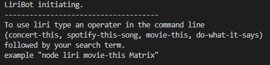
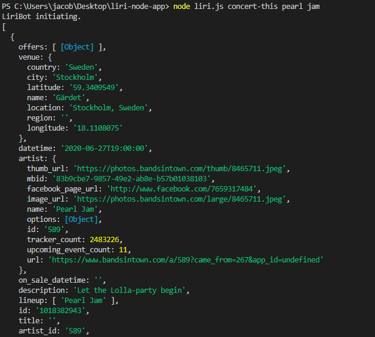

# liri-node-app

## Summary 

Liri is a command line application used in NodeJs. Use it to search for upcoming concerts, songs on spotify, and movies. 

## To Use

While in the directory of liri.js, type "node liri.js " then use the following commands:

* concert-this
* spotify-this-song
* movie this
* do-what-it-says

### Concert This

